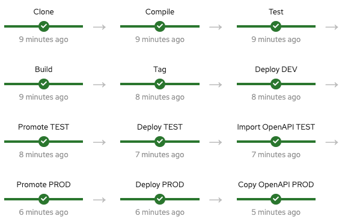

# Contract First Journey with 3scale

This repository is a PoC of a Contract First approach using technologies like Apicurio, Microcks and 3scale on OpenShift.

## Journey

1. Design the API with Apicurio
2. Mock the API in Microcks
4. Implement the API
5. Deploy the API to DEV environment
6. Promote the API to TEST environment and import the API definition (OpenAPI) as a product into 3scale with a Jenkins pipeline using the 3scale Toolbox
7. Test the API and configure 3scale features (limiting, security among other things)
8. If everything is OK, promote the API to PROD with the pipeline (the promotion deploys the API and the 3scale configurations in PROD)

### Pipeline Overview

## Installation

1. [Microcks](./microcks/README.md)
2. [Apicurio](./apicurio/README.md)
3. [3scale](./3scale/README.md)
4. [Jenkins](./jenkins/README.md)
5. [Pipeline](./jenkins/pipeline/README.md)
