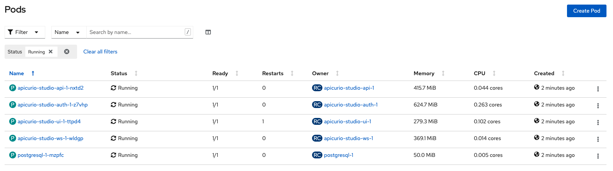
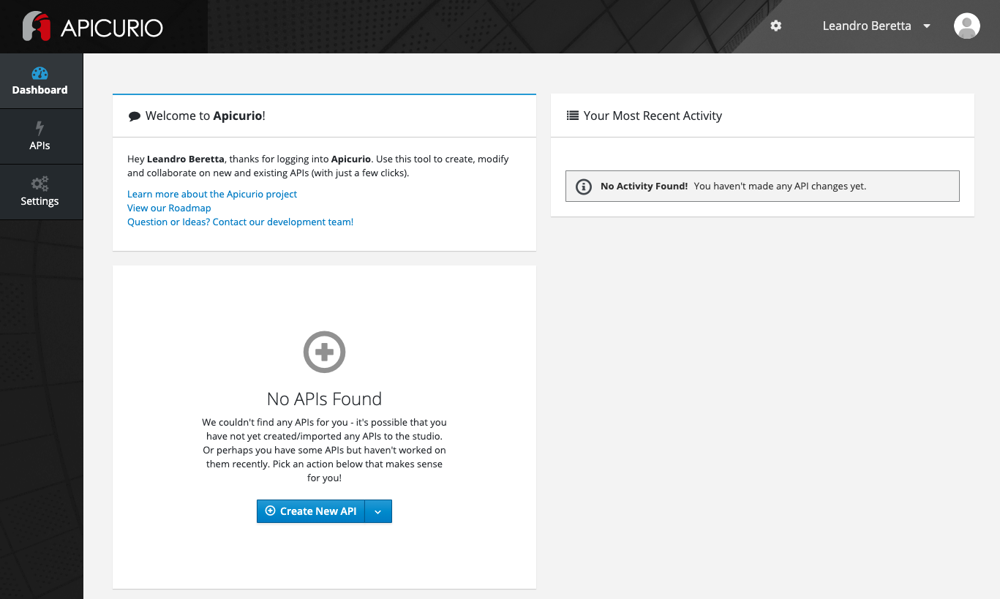
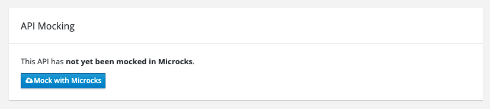

# Apicurio

Deploy Apicurio on OpenShift using [this](https://apicurio-studio.readme.io/docs/running-apicurio-on-openshift-or-docker) documentation as a reference.

First, create a namespace for Apicurio:

```bash
oc create namespace apicurio
```

Then, create the application resources with a template:

```bash
export WILDCARD_DOMAIN=apps.nano.80bd.sandbox847.opentlc.com

oc process -f apicurio-template.yaml \
    -p UI_ROUTE=apicurio-studio.$WILDCARD_DOMAIN \
    -p API_ROUTE=apicurio-studio-api.$WILDCARD_DOMAIN \
    -p WS_ROUTE=apicurio-studio-ws.$WILDCARD_DOMAIN \
    -p AUTH_ROUTE=apicurio-studio-auth.$WILDCARD_DOMAIN | oc apply -f - -n apicurio
```

Verify that all the pods are running.



Finally to try Apicurio, get the route:

echo "https://$(oc get route apicurio-studio-ui -n apicurio -o jsonpath='{.spec.host}')"

Register and then log into Apicurio:



## Microcks Integration

To integrate Apicurio with Microcks some parameters needs to be configured in the UI and the backend of Apicurio.



The next commands gather some data querying the API of Microcks Keycloak:

```bash
export MICROCKS_KEYCLOAK_ADMIN=$(oc get secret microcks-keycloak-admin -o json -n microcks | jq -r .data.username | base64 --decode -)
export MICROCKS_KEYCLOAK_PASSWORD=$(oc get secret microcks-keycloak-admin -o json -n microcks | jq -r .data.password | base64 --decode -)
export MICROCKS_KEYCLOAK_URL=$(oc get route microcks-keycloak -n microcks -o jsonpath='{.spec.host}')

export TOKEN=$(curl -k https://$MICROCKS_KEYCLOAK_URL/auth/realms/master/protocol/openid-connect/token -H "Content-Type: application/x-www-form-urlencoded" -d "grant_type=password&username=$MICROCKS_KEYCLOAK_ADMIN&password=$MICROCKS_KEYCLOAK_PASSWORD&client_id=admin-cli" | jq -r .access_token)

export CLIENT_ID=$(curl -k  https://$MICROCKS_KEYCLOAK_URL/auth/admin/realms/microcks/clients -H "Content-Type: application/json" -H "Authorization: bearer $TOKEN" | jq -r '.[] | select(.clientId == "microcks-serviceaccount").id')

export CLIENT_SECRET=$(curl -k https://$MICROCKS_KEYCLOAK_URL/auth/admin/realms/microcks/clients/$CLIENT_ID/client-secret -H "Content-Type: application/json" -H  "Authorization: bearer $TOKEN" | jq -r .value)

export MICROCKS_URL=$(oc get route microcks -n microcks -o jsonpath='{.spec.host}')

oc set env dc/apicurio-studio-api APICURIO_MICROCKS_API_URL=https://$MICROCKS_URL/api -n apicurio
oc set env dc/apicurio-studio-api APICURIO_MICROCKS_CLIENT_ID=microcks-serviceaccount -n apicurio
oc set env dc/apicurio-studio-api APICURIO_MICROCKS_CLIENT_SECRET=$CLIENT_SECRET -n apicurio

oc set env dc/apicurio-studio-ui APICURIO_UI_FEATURE_MICROCKS=true -n apicurio
```

### Self-signed Certificate Configuration (Optional)

In the integration, Apicurio uses the Microcks API and needs to have the custom certificates loaded into its truststore:

```bash
export MICROCKS_URL=$(oc get route microcks -n microcks -o jsonpath='{.spec.host}')

echo -n | openssl s_client -connect $MICROCKS_URL:443 -servername $MICROCKS_URL -showcerts | sed -ne '/-BEGIN CERTIFICATE-/,/-END CERTIFICATE-/p' > microcks-cert.pem

keytool -import -file microcks-cert.pem -alias microcks -keystore truststore.jks -storepass microcks -trustcacerts -noprompt

oc create secret generic apicurio-truststore --from-file=truststore.jks -n apicurio

oc set volume dc/apicurio-studio-api --add -m /trust --name truststore -t secret --secret-name=apicurio-truststore -n apicurio

rm microcks-cert.pem truststore.jks

oc set env dc/apicurio-studio-api JAVA_TOOL_OPTIONS="-Djava.net.preferIPv4Stack=true -Djavax.net.ssl.trustStore=/trust/truststore.jks -Djavax.net.ssl.trustStorePassword=microcks" -n apicurio
```
