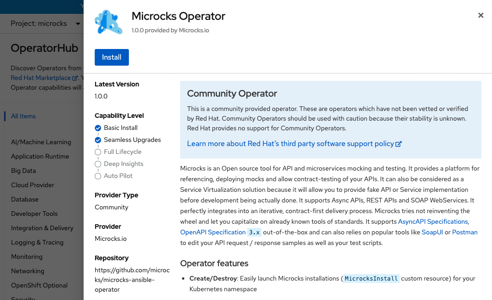
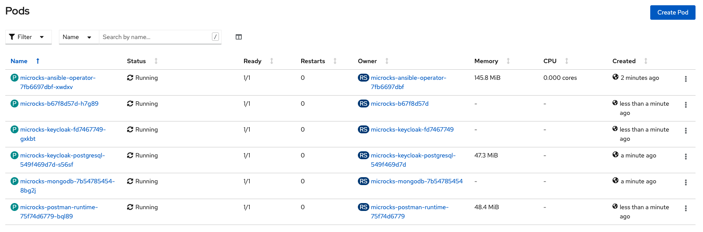

# Microcks

The recommended way to install Microcks is with the Operator using [this](https://microcks.io/documentation/installing/operator/) documentation as a reference.

First, create a namespace for Microcks:

```bash
oc create namespace microcks
```

Then, install the Microcks operator from OperatorHub (in microcks namespace):



Wait for the installation to end:


After the installation, create the following CR:

```bash
echo "apiVersion: microcks.github.io/v1alpha1
kind: MicrocksInstall
metadata:
  name: microcks
spec:
  name: microcks
  version: 1.0.0
  microcks:
    replicas: 1
  postman:
    replicas: 1
  features:
    async:
      enabled: false
      kafka:
        install: false
  keycloak:
    install: true
    persistent: true
    volumeSize: 1Gi
  mongodb:
    install: true
    persistent: true
    volumeSize: 2Gi" | oc apply -f - -n microcks
```

Finally, verify that all the pods are running.


